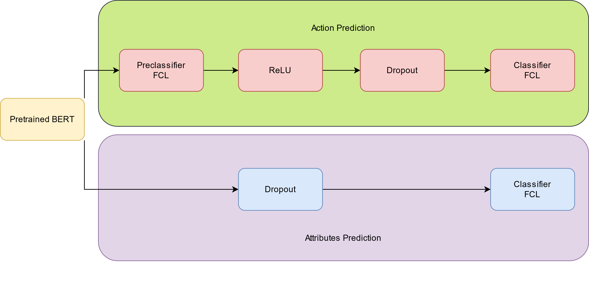

# MLAI-Project-SIMMC-Subtask1-Optimization

This code has been tested with Python 3.7 and 3.8.  
All info can be found in `main.ipynb`, and the code can be directly run from the Jupyter notebook both locally and on Google Colab.  

The dataset is in the `data/simmc_fashion` directory, and has been already preprocessed with the following settings:  
- tokenizer: `BertTokenizer`
- history: `0, 6, 12`
- `NUM_ATTRIBUTES = 14 + 1`

Base model architecture:  

